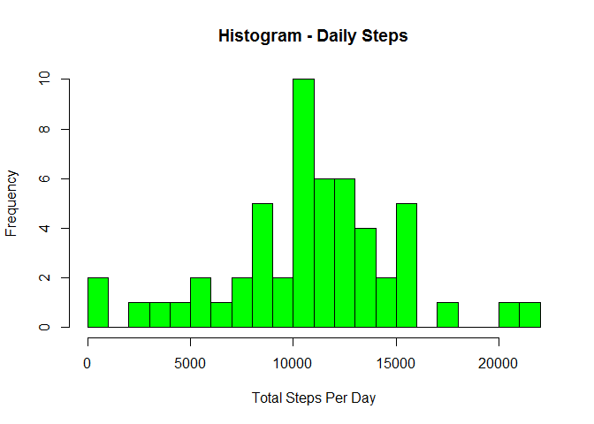
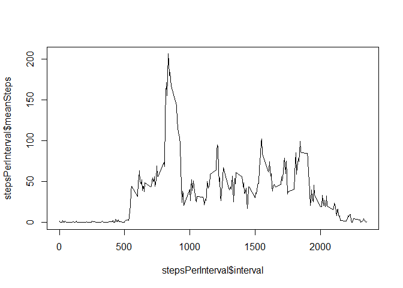
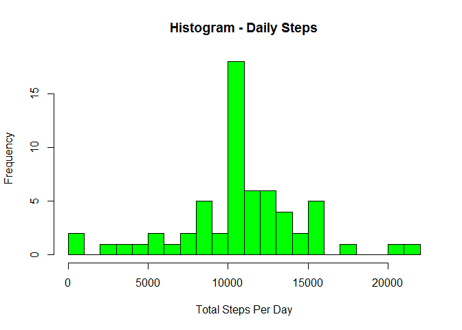
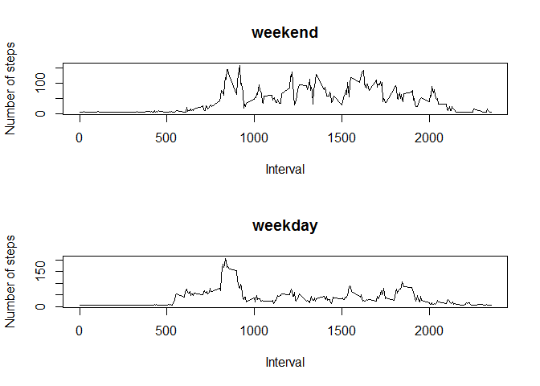

# Reproducible Research: Peer Assessment 1


## Loading and preprocessing the data


```r
activity <- read.csv("activity/activity.csv")
```

## What is mean total number of steps taken per day?


```r
totalStepsPerDay <- aggregate(steps ~ date, activity, sum)

hist(totalStepsPerDay$steps, breaks = 20, col="green", main = "Histogram - Daily Steps", xlab = "Total Steps Per Day")
```

 

```r
meanSteps   <- mean(totalStepsPerDay$steps, na.rm=TRUE)
medianSteps <- median(totalStepsPerDay$steps, na.rm=TRUE)
```

meanSteps = 10766.19
medianSteps = 10765

## What is the average daily activity pattern?


```r
stepsPerInterval <- aggregate(activity$steps, 
                      by = list(interval = activity$interval),
                      mean,
                      na.rm=TRUE)

colnames(stepsPerInterval) <- c("interval", "meanSteps")

plot(stepsPerInterval$interval, stepsPerInterval$meanSteps, type="l")
```

 

Maximum average number of steps occur when:
interval = 835, meanStep = 206.1698113

## Imputing missing values


```r
numMissing <- sum(is.na(activity$steps))
```

Number of missing values is 2304.

Strategy to fill missing values - using mean of 5-minute interval for entire dataset.


```r
missingStepValue <- mean(activity$steps, na.rm = TRUE)
```

Value to be used to replace missing step value = 37.38


```r
filledActivity <- activity
filledActivity$steps[is.na(filledActivity$steps)] <- 37.38

filledtotalStepsPerDay <- aggregate(steps ~ date, filledActivity, sum)

hist(filledtotalStepsPerDay$steps, breaks = 20, col="green", main = "Histogram - Daily Steps", xlab = "Total Steps Per Day")
```

 

```r
filledmeanSteps   <- mean(filledtotalStepsPerDay$steps, na.rm=TRUE)
filledmedianSteps <- median(filledtotalStepsPerDay$steps, na.rm=TRUE)
```

filledmeanSteps = 10766.09
filledmedianSteps = 10765.44

Do these values differ from the estimates from the first part of the assignment?

Without imputing missing values:

meanSteps = 10766.19
medianSteps = 10765

After imputing missing values:

filledmeanSteps = 10766.09 (0.001% difference from without imputing missing value))
filledmedianSteps = 10765.44 (-0.004% difference from without imputing missing value)

The difference is negligible to mean and median steps.

What is the impact of imputing missing data on the estimates of the total daily number of steps?

The general shape between the 2 histograms were similar but the 
the frequency of the bins especially around the centre (10,000+) were significantly higher.
This is probably due to high number of missing values in these bins
and also using the same replacement step value.

## Are there differences in activity patterns between weekdays and weekends?

Install "timeDate" package.


```r
library(timeDate)
```

```
## Warning: package 'timeDate' was built under R version 3.2.2
```

```r
filledActivity$dayType[isWeekday(filledActivity$date)] <- "Weekday"
filledActivity$dayType[isWeekend(filledActivity$date)] <- "Weekend"
sum(is.na(filledActivity$dayType))
```

```
## [1] 0
```

```r
WkendFilledActivity <- filledActivity[filledActivity$dayType == "Weekend",]
WkdayFilledActivity <- filledActivity[filledActivity$dayType == "Weekday",]


WkendstepsPerInterval <- aggregate(WkendFilledActivity$steps, 
                      by = list(interval = WkendFilledActivity$interval),
                      mean)

colnames(WkendstepsPerInterval) <- c("interval", "meanSteps")

WkdaystepsPerInterval <- aggregate(WkdayFilledActivity$steps, 
                      by = list(interval = WkdayFilledActivity$interval),
                      mean)
colnames(WkdaystepsPerInterval) <- c("interval", "meanSteps")

                     
par(mfrow=c(2,1))
plot(WkendstepsPerInterval$interval, WkendstepsPerInterval$meanSteps, type="l", xlab="Interval", ylab="Number of steps", main="weekend")
plot(WkdaystepsPerInterval$interval, WkdaystepsPerInterval$meanSteps, type="l", xlab="Interval", ylab="Number of steps", main="weekday")
```

 

The differences in activity patterns are:

a. Weekday - more activity from 5+am to 8am
b. weekend - more activity from 9am to 8pm 
